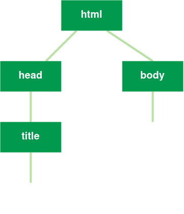

## Orbital 2021 
### HTML/CSS/JS Workshop
Brought to you by NUS Hackers


### INTRODUCTION
- HTML/CSS are not programming languages
- JS is a programming language


### HTML Snippet
```html
<!DOCTYPE html>         
<html lang="en">        
	<head>              
		<title> Hello </title>   
	</head>
	<body>              
		Hello world.
	</body>
</html>
```
- Every web page consists of nested HTML elements
- Each element (HTML tag) describes something on the page e.g, headings, lists, links, etc. 


### Doctype declaration
```html [1]
<!DOCTYPE html>         
<html lang="en">        
	<head>              
		<title> Hello </title>   
	</head>
	<body>           
		Hello world.
	</body>
</html>
```
The **`DOCTYPE`** declaration tells the browser what ver. of HTML to use


### HTML tag
```html [2, 9]
<!DOCTYPE html>         
<html lang="en">        
	<head>              
		<title> Hello </title>   
	</head>
	<body>           
		Hello world.
	</body>
</html>
```
The **`HTML`** tag marks beginning of HTML content, in between the start and closing tags contains all elements in the page


### head tag
```html [3, 5]
<!DOCTYPE html>         
<html lang="en">        
	<head>              
		<title> Hello </title>   
	</head>
	<body>           
		Hello world.
	</body>
</html>
```
The **`head`** of a webpage contains information browsers need to know about


### body tag
```html [6, 8]
<!DOCTYPE html>         
<html lang="en">        
	<head>              
		<title> Hello </title>   
	</head>
	<body>           
		Hello world.
	</body>
</html>
```
The **`body`** = the visible part of a web page


### The DOM
- DOM = document object model
- Each web page is like a tree structure that describes how the HTML elements are related to each other




### Common HTML Elements
- Headings `h1 h2 ... h6`
- Lists
- Images
- Links
- Buttons
- Forms
- so much more!!!

[Mozilla HTML Elements Reference](https://developer.mozilla.org/en-US/docs/Web/HTML/Element)


### Comments in HTML
```html
<!-- You can add comments to html like this -->
```
Starts with `<!--` and ends with `-->`


### Elements for styling text
```
<b>bold<b>
<i>italics<i>
<u>underline<u>
<br/> <!-- Adding whitespace to a page -->
```


### Headings
Used for titles
```html
<h1>Heading 1</h1>
<h2>Heading 2</h2>
<h3>Heading 3</h3>
```


### Lists - Ordered
`<li>` (list items) nested inside `<ol>`
```html
<ol>
    <li> item 1 </li>
    <li> item 2 </li>
</ol>
```


### Lists - Unordered
`<ul>` (list items) nested inside `<ul>`
```html
<ul>
    <li> item 1 </li>
    <li> item 2 </li>
</ul>
```


### Images
```html

```
- `src` defines a link to the image, could be a URL or PATH


### Links
```html
<a href="https://nushackers.org">Click me!</a>
```
- `href` defines link to go to, could be a URL or PATH
- `target` defines... 


### Buttons
```html
<button onclick=clickme()>Click me!</button>
```
- `onclick` is an **event listener** (will be discussed in later slides)


### Forms
- Forms are a little more complex
```html

```


### CSS
```
h1 {
    color: #999;
    font-size: 12px;    
}
```
- CSS = Cascading style sheets
- Every element has CSS style attributes specific to it


### CSS Attributes
Examples of attributes
- `font-family: 'Roboto', serif;` 
- `font-size: 30px;`
- `color: #999999;`
- `padding: 10px;`
- `margin: 10px;`
[Mozilla CSS Attributes Reference](https://developer.mozilla.org/en-US/docs/Web/CSS/Reference)


### Integration with HTML
1. Inline 
2. Within `<style>` tags in the `<head>`
3. In a separate file referenced using `<link>` tags in the `<head>`


### Inline CSS
Specified directly in the element tag using `style` attribute
```html
<h1 style="font-size: 30px">Hello</h1>
```


### Within `<style>` tags
Styles within a `<style>` tag within the `<head>` tag
```html
<head>
    <style>
        h1 {
            font-size: 30px;
        }
    </style>
</head>
```


### Within separate file
`style.css`
```css
h1 {
    font-size: 30px;
}
```
`index.html`
```html2
<head>
    <link rel="stylesheet" href="style.css"/>
</head>
```
- `rel` describes what this link is for
- `href` links to the stylesheet, could be a URL or PATH


### HTML Classes and IDs
- HTML elements can be assigned **classes* and **id**s 
- This is useful for identifying and styling certain elements


### CSS Specificity
```
h1.title {

}

h1#special-title {

}
```
Allows us to select HTML elements based on relationships and identification


### Selecting based on class
```css
.apple {
    color: red;
    font-size: 25px;
}

h1.pear {
    color: green;
    font-size: 30px;
}
```
- `.apple` applies to all elements with `class="apple"`
- `h1.apple` applies to all `<h1>` elements with `class="apple"`


### Selecting based on ID
```css
#apple {
    color: red;
    font-size: 25px;
}

h1#pear {
    color: green;
    font-size: 30px;
}
```
- `.apple` applies to all elements with `id="apple"`
- `h1#apple` applies to all `<h1>` elements with `id="apple"`


### Selecting based on relationships
Based on the document object model (DOM)
```css
div > h1 {
    color: blue;
    font-size: 30px
}
```
`div > h1` selects all `<h1>` elements nested inside a `<div>` element


### A lot more selectors
|Selector|Meaning|
|--------|-------|
|`.a` | Select elements with `class="apple"`|
|`#a` | Select elements with `id="apple"`|
|`a > b` | Select elements `<b>` that are nested in `<a>` |


### Responsive design
Everyone views web pages from their phones now, we need to be able to style for different viewports


### Flexbox


### Media queries


### External Libraries
You don't have to style everything from scratch!! There are libraries out there that help with styling elements and providing responsive styles 
- Bootstrap
- Tailwind CSS


### JavaScript
- Source is a subset of JavaScript!
- Was actually made in 10 days 
- HTML describes what a page looks like 
- JS allows us to add logic
- It can manipulate the DOM!


### Integration with HTML
Done in 2 ways 
1. Using `<script>` tags within `<head>` 
2. In a separate file using `<link>` in `<head>`


### Example 1
```html [3, 9]
    <head>
		<title>Counter</title>
		<script>
				let counter = 0;
				function count() {
					counter++;
					alert(counter);
				}
		</script>
	</head>
	<body>
		<h1>Hello!</h1>
		<button onclick="count()">Count</button>
	</body>
```


### Example 2
Manipulating the DOM
```html
<head>
    <title>Foobar</title>
    <script>
        function foobar() {
            document.querySelector('h1').innerHTML = 'Bar!'
        }
    </script>
</head>
<body>
    <h1>Foo!</h1>
    <button onclick="foobar()">Click me</button>
</body>
```


### Manipulating the DOM
```html [3]
<script>
    function foobar() {
        document.querySelector('h1').innerHTML = 'Bar!'
    }
</script>
```
- `document.querySelector` allows us to extract elements out of the page so we can manipulate them
